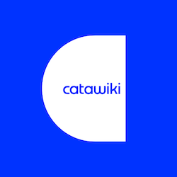

# Become a Catawikian!

A short guide detailing who we are, what we do, how our hiring process works and why our developers like working here. If you like what you see, then you too can [become a Catawikian!](https://www.catawiki.com/jobs/)

## More

- [What is Catawiki?](What%20is%20Catawiki.md)
- [Hiring Process](Hiring%20Process.md)
- [Relocation Process](Relocation%20Process.md)
- [How We Work](How%20We%20Work.md)
- [Stuff We Like](Stuff%20We%20Like.md)

### Why our Developers Love Working Here

**📈 We solve challenges around High Traffic / Load**

Catawiki is the leading online marketplace to buy and sell special objects. We count 10 million unique visitors per month, and 3 million unique visitors per week. In 2021, we sold nearly 3 million special objects and over 10 million. We’re doing things no one has done before - we’re bringing an offline world online through technology and expertise, which brings a lot of unique challenges and opportunities. 

**💎 Microservice Architecture**

35 different microservices, Mainly in Ruby and 3 in Go.

**👩‍💻 Infrastructure as Code**

By maintaining our infrastructure as code, we can quickly review, provision, and scale solutions while maintaining a small, flexible and effective infrastructure team.

**👨‍🎓 Code Reviews**

This helps us spot issues early, it lets team members understand what everyone else is working on, and it allows us to constantly improve by learning how our peers approach and solve problems.

**🔠 A/B Testing**

As we have millions of visitors, we use our in-house AB testing framework to help our teams evaluate their ideas and iterate on them while knowing exactly what our users want the whole time.

**👥 Multidisciplinary teams grouped around domains**

Each team is comprised of a mixture of Front-End, Back-End and Mobile Developers, together with a Product Owner, UX Designer and a Data Scientist who has a steely focus on a particular domain. Still, our engineers can switch between different teams and projects throughout their careers at Catawiki

🇦🇷🇳🇱🇧🇷🇫🇷🇪🇦🇦🇲🇲🇰🇬🇷🇧🇪🇬🇧🇭🇷🇷🇴🇧🇾🇺🇸🇹🇷🇵🇰🇿🇦🇧🇬🇨🇳🇷🇸  
**International Teams**  
🇩🇪🇭🇺🇮🇷🇺🇦🇷🇺🇵🇱🇵🇹🇮🇹🇪🇬🇨🇴🇨🇦🇬🇪🇺🇿🇩🇿🇮🇳🇳🇬🇨🇷🇱🇰🇦🇿🇹🇼

With over 60 nationalities at Catawiki, our diverse and multicultural environment allows everyone to learn new ideas and perspectives while having some fun.

Can't see your flag here? [Join us](https://www.catawiki.com/jobs) and add it yourself!

**🤗Sharing is Caring**

Our teams meet regularly to share what we've learned and other things we're interested in. 

### Diversity Statement

Catawiki’s eclectic teams represent an international and intergenerational mix of people from different professional and cultural backgrounds. We foster an inclusive and queer-friendly work environment committed to welcoming and empowering every Catawikian. Whatever your story is, we encourage you to bring your unique perspective to the table.

Catawiki stands with Ukraine and encourages people displaced by the current conflict to apply. In addition to the several initiatives we’ve launched, we are open to hearing ideas on ways we can continue to support the humanitarian effort.

