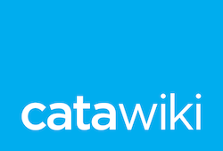

 

# Become a Catawikian!

A short guide detailing who we are, what we do, how our hiring process works and why our developers like working here. If you like what you see, then you too can [become a Catawikian!](https://www.catawiki.com/jobs/) 

## More
* [What is Catawiki?](What%20is%20Catawiki.md)
* [Hiring Process](Hiring%20Process.md)
* [Relocation Process](Relocation%20Process.md)
* [How We Work](How%20We%20Work.md)
* [Stuff We Like](Stuff%20We%20Like.md)

### Why our Developers Love Working Here

**📈 We solve challenges around High Traffic / Load**

As the biggest marketplace for special items, Catawiki operates in a huge market which brings a lot of unique challenges and opportunities

**💎 Microservice Architecture**

35 different microservices, Mainly in Ruby and 3 in Go.

**👩‍💻 Infrastructure as Code**

By maintaining our infrastructure as code we have the ability to quickly review, provision, and scale solutions while maintaining a small, flexible and effective infrastructure team.

**👨‍🎓 Code Reviews**

This helps us spot issues early, it lets team members understand what everyone else is working on and it allows us to constantly improve by learning how our peers approach and solve problems.

**🔠 A/B Testing**

As we have millions of visitors, we use our in-house AB testing framework to help our teams evaluate their ideas and iterate on them while knowing the whole time exactly what our users want.

**👥 Multidisciplinary teams grouped around domains**

Each team comprised of a mixture of Front-End, Back-End and Mobile Developers, together with a Product Owner, UX Designer and a Data Scientist has a steely focus on a particular domain, but our engineers are able to switch between different teams and projects throughout their career at Catawiki. 

🇳🇱🇧🇷🇫🇷🇪🇦🇦🇲🇲🇰🇬🇷🇧🇪🇬🇧🇭🇷🇷🇴🇧🇾🇺🇸  
**International Teams**  
🇩🇪🇭🇺🇮🇷🇺🇦🇷🇺🇵🇱🇵🇹🇮🇹🇪🇬🇨🇴🇨🇦🇬🇪🇺🇿  

With over 50 different nationalities at Catawiki, our diverse and multi-cultural environment allows everyone to learn from new ideas and perspectives while having some fun along the way.

Can't see your flag here? [Join us](https://www.catawiki.com/jobs) and add it yourself!

### Diversity Statement

Catawiki is committed to building a diverse company and diverse teams. That includes everyone, no matter your age, ability, gender, race, religion or sexual orientation. We welcome applications from underserved and underrepresented communities. If you’ve got a story to tell, come and [join us](https://www.catawiki.com/jobs).
